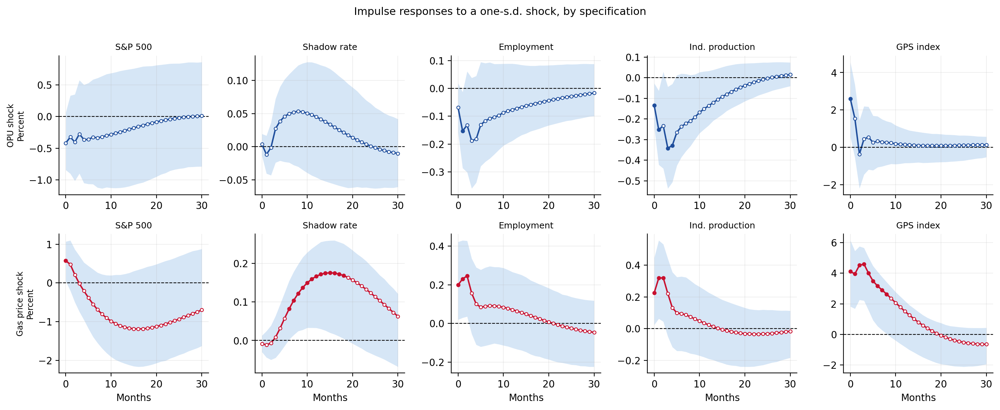

# Searching for Gasoline Prices

Code and data for **"Searching for Gasoline Prices"** (Yoonbin Cho, Soojin Jo, and Myungkyu Shim), a working paper on how consumers' information search responds to gasoline price shocks.

> Work in progress. Results are preliminary and may change.

## Overview

Do consumers pay more attention to gasoline prices when prices rise, or when they become more uncertain? This project measures attention directly with a **Gasoline Price Search (GPS) index** built from U.S. Google Trends data, and compares its response to two kinds of shocks in a structural VAR:

- a **first-moment shock**: an unexpected change in the real retail gasoline price
- a **second-moment shock**: an unexpected rise in oil price uncertainty (OPU)

<p align="center">
  
</p>
<p align="center"><sub>Impulse responses to a one-standard-deviation shock in each specification, with 90% bootstrap bands.</sub></p>

## The GPS index

Monthly, United States, 2010M01–2026M08. Construction follows Appendix A.3 of Bae, Jo, and Shim (2022).

1. **Lexicon.** The lexicon starts from eight seed terms taken from Google's top related queries for "Gasoline" (category: Fuel). Queries containing "near me" (a byproduct of Google's location service, launched in 2015) are excluded, as are duplicates and terms that are too broad or unrelated to gasoline (e.g., "shell", "natural gas"). The final lexicon has 61 terms, listed in `src/keywords.py`.
2. **Rescaling.** Google Trends scales each query to its own peak, so levels are not comparable across terms. Each term is retrieved jointly with the anchor term "gas price", and the pairwise ratio puts all 61 series on a common scale.
3. **Seasonal adjustment.** Each series is seasonally adjusted with X-13ARIMA-SEATS.
4. **Winsorization.** Each series is winsorized at the 2.5th and 97.5th percentiles.
5. **Aggregation.** The series are summed and normalized so that 2010M01 = 100.

## Empirical specification

| | Spec A | Spec B |
|---|---|---|
| Shock | Oil price uncertainty (OPU) | Real retail gasoline price |
| Cholesky ordering | OPU → S&P 500 → shadow rate → employment → IP → GPS | Real gasoline price → S&P 500 → shadow rate → employment → IP → GPS |

- Six-variable VAR in levels with a constant and 3 lags. All variables except the shadow rate enter as 100 × log.
- Recursive (Cholesky) identification, with the shock ordered first and the GPS index last.
- 90% confidence bands from 2,000 residual bootstrap replications; horizon of 30 months.
- Each specification uses the longest sample its data support within 2010M01–2026M08.
- A counterfactual exercise zeroes selected coefficients in the GPS equation to separate the direct effect of each shock from its effects through real activity and through financial conditions and monetary policy.

The VAR routines are written from scratch rather than with `statsmodels.tsa.VAR`, because the counterfactual requires modifying individual structural coefficients. Before any estimation, the notebook validates them against `statsmodels` (impulse responses and variance decompositions agree to machine precision).

## Repository structure

```
gasoline-price-search-index/
├── README.md
├── requirements.txt
├── data/
│   ├── raw/          # inputs that cannot be regenerated by code
│   └── processed/    # gps_index.csv (the final index)
├── notebooks/
│   ├── 01_data_collection.ipynb     # Google Trends retrieval
│   ├── 02_index_construction.ipynb  # rescaling, X-13, winsorization, aggregation
│   └── 03_var_analysis.ipynb        # VARs, IRFs, FEVD, counterfactual decomposition
├── src/
│   ├── keywords.py      # the 61-term lexicon and anchor term
│   └── var_toolkit.py   # VAR estimation, bootstrap, and counterfactual routines
└── output/              # figures and tables produced by 03
```

## Data

| File | Source | Notes |
|---|---|---|
| `data/raw/gtrends_single_terms.csv` | Google Trends, via [trendspy](https://github.com/sdil87/trendspy) | 61 terms, U.S., monthly |
| `data/raw/gtrends_anchor_ratios.csv` | Google Trends, via trendspy | Each term retrieved jointly with "gas price" |
| `data/raw/OPU_index_monthly.csv` | [policyuncertainty.com](https://www.policyuncertainty.com/oil_uncertainty.html) | Oil price uncertainty index |
| `data/raw/WuXiaShadowRate.csv` | [Federal Reserve Bank of Atlanta](https://www.atlantafed.org/cqer/research/wu-xia-shadow-federal-funds-rate) | Spliced with the effective federal funds rate after 2023M06 |
| `data/processed/gps_index.csv` | Constructed | Output of `02_index_construction` |

The real gasoline price is the regular conventional retail price (GASREGCOVM) deflated by the CPI (CPIAUCSL).

**Google Trends data are sampled.** Google draws a new sample for each request, so re-running `01_data_collection` returns slightly different values. The files in `data/raw/` are the pulls used in the paper (retrieved <YYYY-MM-DD>) and are the starting point for exact replication.

**FRED series are revised.** To keep results reproducible, `03_var_analysis` reads the saved snapshot rather than downloading current vintages.

The S&P 500 series is not redistributed because of licensing restrictions. `03_var_analysis` downloads it at run time (Yahoo Finance via `yfinance`, with FRED as a fallback).

## Replication

**In Google Colab (easiest).** Open any notebook from this repository in Colab. The first cell clones the repository and sets paths automatically.

**Locally.**

```bash
git clone https://github.com/YBcho02/gasoline-price-search-index.git
cd gasoline-price-search-index
pip install -r requirements.txt
```

Then run the notebooks from inside `notebooks/`, in order:

1. `01_data_collection.ipynb` (optional). Re-downloads the Google Trends data. Skip it to reproduce the paper's index exactly. Existing files in `data/raw/` are not overwritten unless `OVERWRITE = True`.
2. `02_index_construction.ipynb` builds `data/processed/gps_index.csv`.
3. `03_var_analysis.ipynb` estimates both specifications and writes figures and tables to `output/`.

`02_index_construction` downloads and installs the X-13ARIMA-SEATS binary for Linux, which covers Colab. On other systems, obtain the binary from the [U.S. Census Bureau](https://www.census.gov/data/software/x13as.html) and set the `X13PATH` environment variable to its folder.

The project was originally developed in Google Colab and migrated to GitHub for public release.

## References

- Bae, S., Jo, S., and Shim, M. (2022). United States of Mind under Uncertainty. SSRN Working Paper No. 4309872. https://ssrn.com/abstract=4309872
- Wu, J. C., and Xia, F. D. (2016). Measuring the Macroeconomic Impact of Monetary Policy at the Zero Lower Bound. *Journal of Money, Credit and Banking*, 48(2–3), 253–291.

## Contact

Yoonbin Cho · 143bin@snu.ac.kr
